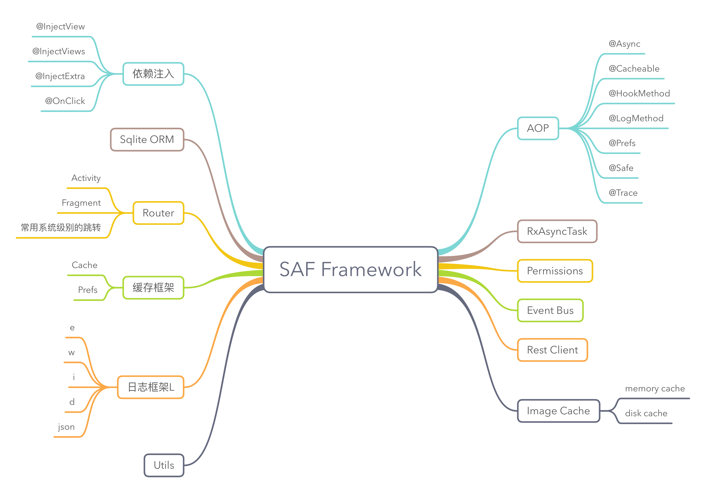

# SAF

[](http://www.weibo.com/fengzhizi715)
[](https://travis-ci.org/fengzhizi715/SAF)
[](https://www.codacy.com/app/fengzhizi715/SAF?utm_source=github.com&amp;utm_medium=referral&amp;utm_content=fengzhizi715/SAF&amp;utm_campaign=Badge_Grade)
[](https://www.apache.org/licenses/LICENSE-2.0.html)


SAF(Simple Android Framework)最早的定位是一个简单的Android框架，现在它可以为Android App开发提供一系列基础性的组件。这个项目第一次提交到google code是2012年的3月26号，我已经断断续续做了5年多了。  

SAF曾经在多个项目中使用，包括今夜酒店特价app、锦江之星app、京东内部的多个app(京东众包、京明管家、众包商户端、众包运作主管)等等。
目前google code上的工程早已暂停维护，全部迁移到github上。SAF目前文档版本是1.1.19，下一个版本会是1.2.0。1.2.0发布在即，会有很多新的变化和特性。

遇到任何问题欢迎跟我联系，玩得开心:)

除了SAF自带的demo app外，[魔窗的android demo app](https://github.com/magicwindow/mw-androidsdk-example)也使用了SAF，而且也是开源的


## 主要功能




* [AOP(use aspectj)](https://github.com/fengzhizi715/SAF-AOP) AOP相关的注解框架
* [RxAsyncTask(use rxjava)](docs/rxasynctask.md) 使用RxJava开发的AsyncTask，区别于Android系统自带的AsyncTask
* [Event Bus](docs/event_bus.md) 事件总线
* [Rest Client](docs/rest_client.md) 网络框架
* [Dependency Injection(use apt)](https://github.com/fengzhizi715/SAF-Kotlin-InjectView) 依赖注入
* [Sqlite ORM](docs/sqlite_orm.md) 数据库操作框架
* [Router](https://github.com/fengzhizi715/SAF-Kotlin-Router) Activity、Fragment的路由框架
* [Cache](docs/cache.md) 缓存框架
* [L](https://github.com/fengzhizi715/SAF-Kotlin-log) 日志框架
* Permission 权限框架，用于适配android6.0之后新的权限框架
* RxLifecycle 管理Activity、Fragment生命周期的框架，防止由于使用RxJava而产生内存泄漏
* [Utils](docs/utils.md) 各种工具类


## SAF子项目

SAF已经拆分成多个子项目，每个子项目都可以单独使用，没有任何的依赖关系。

* 日志框架：https://github.com/fengzhizi715/SAF-Kotlin-log

  下载：
  ```groovy
  compile 'com.safframework.log:saf-log:1.2.0'
  ```
  
* Activity路由框架：https://github.com/fengzhizi715/SAF-Kotlin-Router

  下载：
  ```groovy
  apply plugin: 'com.neenbedankt.android-apt'

  ...

  dependencies {
     compile 'com.safframework.router:saf-router:1.1.2'
     apt 'com.safframework.router:saf-router-compiler:1.1.0'
     ...
  }
  ```

* 依赖注入框架：https://github.com/fengzhizi715/SAF-Kotlin-InjectView
  
  下载：
  ```groovy
  apply plugin: 'com.neenbedankt.android-apt'
  
  ...
  
  dependencies {
      compile 'com.safframework.injectview:saf-injectview:1.1.0'
      apt 'com.safframework.injectview:saf-injectview-compiler:1.1.0'
      ...
  }
  ```
* AOP框架：https://github.com/fengzhizi715/SAF-AOP
  
  下载：
  ```groovy
  compile 'com.safframework:saf-aop:1.1.4'
  ```
  
* 缓存框架：在saf项目中，并未单独拆分成独立的项目

  下载：
  ```groovy
  compile 'com.safframework:saf-cache:1.1.0'
  ```

* 消息队列框架：在saf项目中，并未单独拆分成独立的项目

  下载：
  ```groovy
  compile 'com.safframework:saf-queue:1.0.0'
  ```  
* 权限框架：在saf项目中，并未单独拆分成独立的项目

  下载：
  ```groovy
  compile 'com.safframework:saf-permission:1.0.0'
  ```
* RxLifecycle:在saf项目中，并未单独拆分成独立的项目

  下载：
  ```groovy
  compile 'com.safframework:saf-rxlifecycle:1.0.0'
  ```

# ChangeLog

[版本更新记录](CHANGELOG.md)

# Author


联系方式

Blog: http://www.jianshu.com/users/4f2c483c12d8/

Github: https://github.com/fengzhizi715

E-mail：fengzhizi715@126.com

Wechat：fengzhizi715

# Contributors

1. [frankswu](https://github.com/frankswu) 完善老版本的Inject框架和Router框架
2. [ymcao](https://github.com/ymcao) 增加AsyncTask替换android系统的AsyncTask
3. [aaron](https://github.com/snailflying) 修改build.gradle，支持多个module合并到一个jar包。

# TODO

1. Utils 全部用Kotlin重写
2. 优化Router框架

License
-------

    Copyright (C) 2012 - present Tony Shen.

    Licensed under the Apache License, Version 2.0 (the "License");
    you may not use this file except in compliance with the License.
    You may obtain a copy of the License at

       http://www.apache.org/licenses/LICENSE-2.0

    Unless required by applicable law or agreed to in writing, software
    distributed under the License is distributed on an "AS IS" BASIS,
    WITHOUT WARRANTIES OR CONDITIONS OF ANY KIND, either express or implied.
    See the License for the specific language governing permissions and
    limitations under the License.
